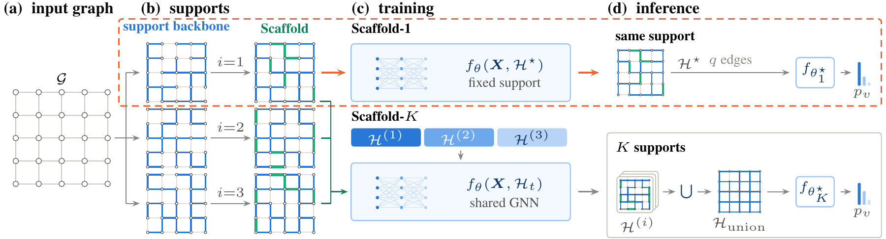
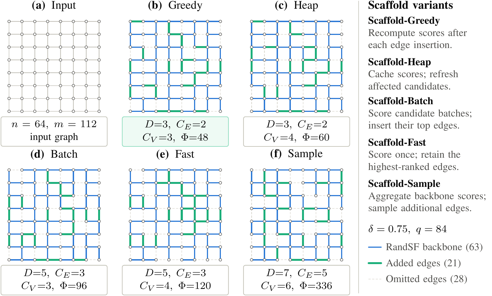
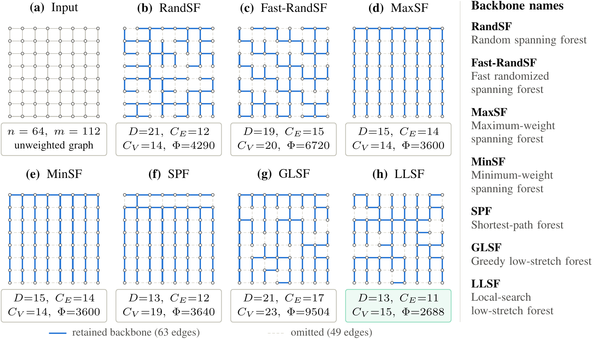
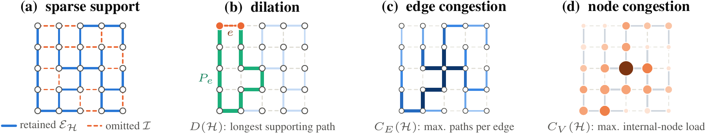

# Scaffold

**Sparse graph supports for GNN training and inference.** Scaffold starts from a spanning forest and retains edges that improve supporting-path dilation and congestion.

<p align="center"></p>

This repository contains the research implementation, shared TunedGNN settings, and the comparison methods in `RelatedMethods/`. The reported-accuracy recipe is reserved in [`configs/reported_accuracy.yaml`](configs/reported_accuracy.yaml) and is **not yet finalized**. Smoke tests check execution, not reproduction of paper accuracy.

## Install

Use Python 3.11 or 3.12 on Linux. Install a CUDA-compatible [PyTorch](https://pytorch.org/get-started/locally/) and the matching [PyG extension wheels](https://pytorch-geometric.readthedocs.io/en/latest/install/installation.html) first. `torch-sparse` and `torch-scatter` are required by the comparison models and partitioning; their wheels must match your PyTorch/CUDA versions.

```bash
python -m pip install -e .
python scripts/check_environment.py
python run.py --list
python run.py --method scaffold-fast --dataset karate --smoke --workers 2
```

The runner selects the visible CUDA device with the most free memory. For a CPU-only test, add `--device cpu`. It never requests a Slurm allocation. `--workers auto` respects CPU affinity and `SLURM_CPUS_PER_TASK`; explicit worker counts are capped at the available allocation. Use the same Python environment for the launcher and its subprocesses.

## Run an experiment

```bash
# One support, reused throughout training and inference (Scaffold-1).
python run.py --method scaffold-fast --dataset cora --ratio 0.7 \
  --backbone fast-randsf --workers auto

# Refreshed supports; validation-selected bank; one forward pass on the union.
python run.py --method scaffold-sample --dataset cora --ratio 0.7 \
  --mode multi --views 5 --refresh-every 20 --sample-forests 5

# Same dataset's shared GCN settings for the full-graph comparator.
python run.py --method full --dataset cora

# Inspect every resolved setting without downloading data or starting training.
python run.py --method scaffold-batch --dataset ogbn-products --dry-run
```

`--epochs`, `--runs`, and `--seed` override the shared defaults. Without `--ratio`, the dataset's target ratio in `configs/datasets.yaml` is used. Ratios count retained undirected edges; a union of supports can exceed the per-support budget. A complete spanning forest needs at least `n − c` edges for `c` connected components. Below that budget, legacy partial-support policies cannot preserve connectivity.

## Choose an algorithm

| Method | Construction | Intended use |
|---|---|---|
| `scaffold-greedy` | Recompute scores after each insertion | Small graphs; reference |
| `scaffold-heap` | Cache paths and refresh affected candidates | Small graphs |
| `scaffold-batch` | Score candidate batches; insert their top edges | Medium/large graphs |
| `scaffold-fast` | Score on the initial forest, then select edges | Medium/large graphs |
| `scaffold-sample` | Precompute weights across forests; draw supports | Medium/large graphs; frequent refresh |

Batch defaults to 512 candidates and 64 insertions per cluster round; change them with `--batch-size` and `--add-per-round`. Fast and Batch distribute cluster work across CPU workers. Sample's `--sample-forests` controls weight precomputation, independently of the inference `--views` count.

<p align="center"></p>

## Data, settings, and results

| Configuration | Dataset storage | Outputs and caches |
|---|---|---|
| `--config public` (default) | `./data` | `./results` |
| `--config deception` | `SCAFFOLD_DATA_ROOT` or ignored local override | `./results` |

Relative paths are resolved from the repository root in an editable checkout, or from the working directory after installing a wheel. Public datasets and verified split assets are downloaded by the shared loader when required. For existing datasets:

```bash
export SCAFFOLD_DATA_ROOT=/path/to/existing/datasets
python run.py --config deception --method scaffold-fast --dataset reddit --workers 32
```

Each run writes `resolved.json`, `run.log`, and `status.json` in a unique results directory. Native metric files and shared `metrics.csv` are preserved where produced. Cached partitions, Sample weights, and spectral artifacts live below `results/cache`. Keep caches when measuring warm-start performance; use a fresh cache directory for cold-start measurements. Process wall time includes initialization; method-reported training time is a separate quantity.

- [`configs/tunedgnn_presets.py`](configs/tunedgnn_presets.py): common architecture, optimizer, training schedules, and dataset profiles.
- [`configs/datasets.yaml`](configs/datasets.yaml): 19 paper datasets and retention sweeps.
- [`configs/methods/`](configs/methods): method-specific settings and launchers.
- [`docs/METHODS.md`](docs/METHODS.md): all comparison commands, implementation differences, and optional dependencies.
- [`docs/VALIDATION.md`](docs/VALIDATION.md): execution checks and their limits.

The data loader is self-contained; no EDSparse checkout or installation is required. Tuned GraphSAGE uses the shared **GraphSAGE** preset; Tuned GraphSAINT-RW uses the shared GCN architecture with random-walk sampling. Learned-baseline adapters and their larger-graph approximations are identified in the method documentation.

## Support backbones

All backbones return a spanning **forest** on disconnected inputs. A tree is the connected special case. `fast-randsf` is the default randomized Kruskal backbone; it does not sample uniformly from all spanning trees.

| Name | Meaning |
|---|---|
| `randsf`, `fast-randsf` | Randomized / strided randomized spanning forest |
| `maxsf`, `minsf` | Maximum-/minimum-weight spanning forest |
| `fast-maxsf`, `fast-minsf` | Bucketed approximate weighted forest |
| `randspt` (`randspf`) | Random-root shortest-path forest |
| `glsf` | Greedy low-stretch forest; slow |
| `slsf` | Scalable low-stretch heuristic |
| `llsf` | Local-search low-stretch forest; slow |

Legacy names such as `randst`, `maxst`, `mst`, `glst`, `slst`, and `llst` remain accepted. Use Greedy/Heap and low-stretch search backbones only on small graphs. The visualization below is unweighted; weighted backbones may produce different supports when supplied with edge weights.

Feature-derived weights can be selected with `--edge-weights cosine` (also `euclidean` or `dot`); `--weighted-paths` additionally enables weighted supporting-path lengths. Uniform weights and hop-count paths are the default.

<p align="center"></p>

<details><summary>Supporting paths, dilation, and congestion</summary>

</details>

## Anonymous submission export

```bash
python scripts/export_anonymous.py --output dist/scaffold-anonymous.zip
```

The archive excludes Git history/remotes, local path overrides, datasets, results, caches, and compiled artifacts. It retains third-party license notices. See [`THIRD_PARTY_NOTICES.md`](THIRD_PARTY_NOTICES.md) for attribution and [`docs/REPRODUCIBILITY.md`](docs/REPRODUCIBILITY.md) before preparing accuracy or runtime comparisons.
